# 🎓 Academic MCP-RAG Client - Intelligent University Assistant

## 🛡️ Overview

This project is a sophisticated AI-powered chat client designed to serve as a comprehensive "University Assistant." It
leverages a powerful combination of **Retrieval-Augmented Generation (RAG)** for answering questions based on internal
university data and the **Model Context Protocol (MCP)** for extending its capabilities with external academic tools and
APIs.

The primary goal is to provide a single, intelligent interface for users to query university information, perform
complex calculations, and access external academic databases, all through a natural language chat interface with
enterprise-grade architecture and real-time responsiveness.

### 🏗️ Architecture

The system consists of a sophisticated multi-component architecture that demonstrates modern AI integration patterns:

```mermaid
graph TD
    subgraph "User Interface Layer"
        A[🌐 Web Browser]
        B[📱 Real-time Chat Interface]
    end

    subgraph "Client Application (localhost:8234)"
        C[🔌 WebSocket Handler]
        D[💬 McpChatService]
        E{MessageFilterService}
        F[🧠 UniversityRagService]
        G[(📚 InMemoryVectorStore)]
        H[🧩 MCP Client Integration]
        I[📊 DataLoaderService]
    end

    subgraph "External MCP Server (localhost:8082)"
        J[🔗 MCP Server Endpoint]
        K{Tool Executor}
        L[🧮 GPA Calculator]
        M[📈 Statistics Engine]
        N[🔍 Academic Lookup]
        O[🌐 External API Gateway]
    end
    
    subgraph "Data Sources"
        P[📄 university_data.xlsx]
        Q[💾 vector_store.bin]
        R[🌍 External APIs]
    end

    %% User Flow
    A -- "User Queries" --> B
    B -- "WebSocket" --> C
    C -- "Process Message" --> D
    D -- "Route Query" --> E
    
    %% Query Routing
    E -- "Simple Chat" --> D
    E -- "Complex Query" --> F
    
    %% RAG Pipeline
    F -- "Vector Search" --> G
    G -- "Retrieved Context" --> F
    F -- "Enhanced Prompt" --> H
    
    %% MCP Integration
    H -- "Tool Requests" --> J
    J -- "Execute Tools" --> K
    K -- "GPA Calculation" --> L
    K -- "Statistical Analysis" --> M
    K -- "Academic Search" --> N
    N -- "External APIs" --> O
    O -- "API Responses" --> R
    
    %% Data Management
    I -- "Load Data" --> P
    I -- "Process & Vectorize" --> G
    G -- "Persist" --> Q
    
    %% Response Flow
    L --> K
    M --> K
    N --> K
    K -- "Tool Results" --> J
    J -- "MCP Response" --> H
    H -- "Final Answer" --> F
    F -- "Response" --> D
    D -- "WebSocket" --> C
    C -- "Display" --> B
    
    %% Style Definitions
    classDef user fill:#e6f3ff,stroke:#0066cc,stroke-width:2px;
    classDef client fill:#e6ffe6,stroke:#009933,stroke-width:2px;
    classDef server fill:#ffe6e6,stroke:#cc0000,stroke-width:2px;
    classDef data fill:#f0f0f0,stroke:#666,stroke-width:2px;
    
    class A,B user;
    class C,D,E,F,G,H,I client;
    class J,K,L,M,N,O server;
    class P,Q,R data;
```



#### **System Flow Breakdown:**

1. **User Interface Layer** (🌐):
    - **Real-time Chat Interface**: Modern, responsive web UI with WebSocket connectivity
    - **Instant Feedback**: Real-time message processing and response streaming

2. **Client Application Core** (🎯 localhost:8234):
    - **WebSocket Handler**: Manages persistent connections for real-time communication
    - **McpChatService**: Orchestrates conversation flow and context management
    - **MessageFilterService**: Intelligent query routing based on complexity and intent
    - **UniversityRagService**: Advanced RAG pipeline with hybrid search capabilities
    - **InMemoryVectorStore**: High-performance vector database for semantic search
    - **MCP Client Integration**: Seamless tool integration via Model Context Protocol

3. **External Tool Integration** (🔧 localhost:8082):
    - **MCP Server Endpoint**: Standardized tool execution platform
    - **Academic Calculators**: GPA calculations, statistical analysis engines
    - **External API Gateway**: Integration with ArXiv, CrossRef, Google Scholar
    - **Tool Orchestration**: Intelligent tool selection and execution management

4. **Data Management Pipeline** (📊):
    - **Excel Integration**: Human-readable data source (`university_data.xlsx`)
    - **Vector Processing**: Automatic embedding generation and storage
    - **Persistent Storage**: Binary vector store for fast retrieval
    - **Incremental Updates**: Smart data loading with change detection

#### **Key Integration Points:**

- **RAG-First Strategy**: Prioritizes internal knowledge base before external tool usage
- **Contextual Tool Selection**: LLM intelligently chooses appropriate tools based on query analysis
- **Real-time Processing**: Sub-second response times for most queries
- **Scalable Architecture**: Designed for enterprise deployment with containerization support

## ✨ Key Features

### 🧠 Advanced RAG Capabilities

- **Hybrid Search**: Combines semantic similarity with keyword matching
- **Contextual Retrieval**: Maintains conversation context across multiple turns
- **Smart Chunking**: Optimized document segmentation for better retrieval
- **Persistent Knowledge**: Vector store grows incrementally as new data is added

### 🧰 Comprehensive Academic Tools

- **`GPA Calculator`**: Calculate student and course GPAs with detailed statistical breakdowns
- **`Statistics Engine`**: Advanced statistical analysis (mean, median, standard deviation, percentiles, distributions)
- **`Academic Lookup`**: Multi-source academic paper search:
    - ArXiv preprint server integration
    - CrossRef academic publications database
    - Google Scholar API connectivity
    - Author and citation network analysis

### 🚀 Enterprise-Grade Architecture

- **Real-time WebSocket Communication**: Instant message processing and response streaming
- **Containerized Deployment**: Full Docker and Docker Compose support
- **Scalable Vector Storage**: In-memory vector database with persistent backup
- **Intelligent Query Routing**: Context-aware message filtering and processing
- **Tool Change Notifications**: Dynamic tool discovery and integration

### 🎯 Smart Query Processing

- **Intent Recognition**: Distinguishes between conversational queries and complex data requests
- **Context Preservation**: Maintains conversation history and retrieved data context
- **Fallback Strategies**: Graceful degradation when tools are unavailable
- **Multi-turn Conversations**: Coherent dialogue across extended interactions

## 📂 Project Structure

```
client/
├── pom.xml                                    # Maven dependencies (Spring Boot 3.4+, WebSocket, AI)
├── mvn17.sh                                  # Java 17+ Maven wrapper (Linux/macOS)
├── mvn17.bat                                 # Java 17+ Maven wrapper (Windows)
├── Dockerfile                                # Container deployment configuration
├── data/
│   ├── university_data_generator.html        # 🛠️ Interactive data generation tool
│   └── vector_store.bin                      # 🧠 Persistent vector knowledge base
└── src/main/
    ├── java/com/example/client/
    │   ├── AcademicMcpClient.java           # 🚀 Main Spring Boot application entry point
    │   ├── config/
    │   │   ├── WebSocketConfig.java         # WebSocket configuration and STOMP setup
    │   │   ├── ThreadPoolConfig.java        # Async processing and thread management
    │   │   └── AiConfiguration.java         # AI service beans and MCP integration
    │   ├── controller/
    │   │   ├── ChatController.java          # REST endpoints for health and status
    │   │   └── WebSocketController.java     # Real-time message handling
    │   ├── listener/
    │   │   └── WebSocketEventListener.java  # Connection lifecycle management
    │   ├── model/                            # 📊 Data models and DTOs
    │   │   ├── Student.java                 # Student record structure
    │   │   ├── Course.java                  # Course information model
    │   │   ├── Grade.java                   # Grade and assessment data
    │   │   ├── Research.java                # Research project metadata
    │   │   └── ChatMessage.java             # WebSocket message protocol
    │   ├── service/                          # 🧠 Core business logic
    │   │   ├── McpChatService.java          # Main conversation orchestration
    │   │   ├── MessageFilterService.java    # Query classification and routing
    │   │   ├── UniversityRagService.java    # Advanced RAG pipeline implementation
    │   │   ├── DataLoaderService.java       # Excel processing and data ingestion
    │   │   └── McpClientService.java        # MCP protocol client implementation
    │   └── storage/                          # 💾 Data persistence and retrieval
    │       ├── InMemoryVectorStore.java     # High-performance vector database
    │       └── VectorStoreManager.java      # Persistence and backup management
    └── resources/
        ├── data/
        │   └── university_data.xlsx          # 📋 Source data (students, courses, research)
        ├── templates/                        # 🎨 Thymeleaf HTML templates
        │   ├── chat.html                     # Main chat interface
        │   └── layout.html                   # Base template layout
        ├── static/                           # 🎨 Web assets
        │   ├── css/chat.css                  # Modern chat interface styling
        │   └── js/chat.js                    # Real-time WebSocket client
        └── application.properties            # 🔧 Spring Boot configuration
```

### 🧠 Core Service Deep Dive

#### **`UniversityRagService.java`** - The Intelligence Engine

```java

@Service
public class UniversityRagService {

	// RAG-First, Tool-Fallback Strategy Implementation
	public String processComplexQuery(String query, List<ChatMessage> history) {
		// 1. Semantic search in vector store
		List<String> relevantChunks = vectorStore.hybridSearch(query, maxChunks);

		// 2. Build contextual prompt with retrieved data
		String enhancedPrompt = buildRagPrompt(query, relevantChunks, history);

		// 3. LLM processes with tool availability
		return chatClient.call(enhancedPrompt);  // May trigger MCP tools
	}
}
```

#### **`InMemoryVectorStore.java`** - High-Performance Retrieval

```java

@Component
public class InMemoryVectorStore {

	// Hybrid search combining semantic and lexical matching
	public List<String> hybridSearch(String query, int maxResults) {
		// 1. Generate query embedding
		float[] queryVector = embeddingClient.embed(query);

		// 2. Compute cosine similarities
		List<ScoredChunk> semanticResults = computeSimilarities(queryVector);

		// 3. Apply keyword boosting
		List<ScoredChunk> hybridResults = applyKeywordBoost(query, semanticResults);

		return hybridResults.stream().limit(maxResults).map(ScoredChunk::getText).collect(Collectors.toList());
	}
}
```

## 🚀 Getting Started

### Prerequisites

#### Java Requirements (Critical)

**⚠️ Java 17 or higher is mandatory** - This project uses modern Java features and Spring Boot 3.x which requires Java
17+. The application will **not compile or run** with earlier Java versions.

**Check Your Java Version:**

```bash
java -version
# Should output: openjdk version "17.0.x" or higher
```

**If Java 17+ is your system default:**

```bash
mvn clean install
mvn spring-boot:run
```

**If Java 17+ is installed but not default:**

```bash
# Linux/macOS
./mvn17.sh clean install
./mvn17.sh spring-boot:run

# Windows
mvn17.bat clean install
mvn17.bat spring-boot:run
```

**Installing Java 17+ if needed:**

```bash
# Ubuntu/Debian
sudo apt update && sudo apt install openjdk-17-jdk

# macOS with Homebrew
brew install openjdk@17

# Windows with Chocolatey
choco install openjdk17

# Or download from: https://adoptium.net/
```

#### Other Requirements

- **Apache Maven 3.8+**: Build tool and dependency management
- **Docker & Docker Compose**: For containerized deployment
- **Azure OpenAI Account**: API keys for chat completions and embeddings
- **IDE configured for Java 17+**: IntelliJ IDEA, VS Code, or Eclipse

#### IDE Configuration for Java 17+

**IntelliJ IDEA:**

```
File → Project Structure → Project
├── Project SDK: Java 17+
├── Project language level: 17 or higher
└── File → Settings → Build → Maven → Importing → JDK for importer: Java 17+
```

**VS Code:**

```
1. Install Extension Pack for Java
2. Ctrl+Shift+P → "Java: Configure Runtime"
3. Set Java 17+ as project runtime
```

**Eclipse:**

```
Window → Preferences → Java → Installed JREs
├── Add Java 17+ if not present
└── Project Properties → Java Build Path → Libraries → Replace JRE with Java 17+
```

### 🏃 Quick Start Guide

#### Option 1: Local Development (Recommended for Development)

1. **Clone and Navigate:**
   ```bash
   git clone <repository-url>
   cd <project-directory>/client
   ```

2. **Verify Java Installation:**
   ```bash
   java -version  # Must show 17+
   javac -version # Must show 17+
   ```

3. **Build the Project:**
   ```bash
   # If Java 17+ is your default
   mvn clean install
   
   # If Java 17+ is installed but not default
   ./mvn17.sh clean install    # Linux/macOS
   mvn17.bat clean install     # Windows
   ```

4. **Configure Environment Variables:**

   Create a `.env` file in your project root:
   ```bash
   # -- Azure OpenAI Configuration --
   AZURE_OPENAI_ENDPOINT=https://YOUR_RESOURCE.openai.azure.com/
   AZURE_OPENAI_API_KEY=your_api_key_here
   
   # -- Embeddings API (often different deployment) --
   AZURE_OPENAI_EMBEDDING_ENDPOINT=https://YOUR_RESOURCE.openai.azure.com/openai/deployments/YOUR_EMBEDDING_MODEL/embeddings?api-version=2023-05-15
   AZURE_OPENAI_EMBEDDING_API_KEY=your_api_key_here
   
   # -- MCP Server Connection --
   MCP_SERVER_URL=http://localhost:8082/mcp/message
   ```

5. **Start External Dependencies:**

   **Start the MCP Server first** (separate project):
   ```bash
   # In the server directory
   mvn spring-boot:run
   # Wait for: "Academic MCP Server Ready"
   ```

6. **Start the Client Application:**
   ```bash
   # If Java 17+ is default
   mvn spring-boot:run
   
   # If using wrapper scripts
   ./mvn17.sh spring-boot:run    # Linux/macOS
   mvn17.bat spring-boot:run     # Windows
   ```

7. **Verify Startup:**
   Look for the success banner:
   ```
   ===================================================
               🎓 Academic MCP-RAG Client Ready
   ===================================================
   Chat Interface: http://localhost:8234
   Health Check:   http://localhost:8234/actuator/health
   Vector Store:   Loaded with X documents, Y chunks
   MCP Server:     Connected to localhost:8082
   ===================================================
   ```

8. **Access the Application:**
   Open your browser to `http://localhost:8234`

#### Option 2: Docker Compose (Production-like Deployment)

**Prerequisites:** Ensure your JARs are built first (see step 3 above).

1. **Prepare Environment:**
   ```bash
   # Ensure .env file exists in project root
   # Ensure both server and client JARs are built
   mvn clean install  # or ./mvn17.sh clean install
   ```

2. **Start Full Stack:**
   ```bash
   docker-compose up --build
   ```

   This orchestrates:
    - **MCP Server** (localhost:8082): Academic tools and external API integration
    - **RAG Client** (localhost:8234): Main chat interface with vector database
    - **Volume Mounting**: Persistent data storage for vector store
    - **Health Checks**: Ensures proper startup sequencing

3. **Monitor Startup:**
   ```bash
   # Watch logs in separate terminal
   docker-compose logs -f
   
   # Check individual services
   docker-compose logs server
   docker-compose logs client
   ```

4. **Verify Services:**
    - **Client Interface**: http://localhost:8234
    - **Server Health**: http://localhost:8082/health
    - **Client Health**: http://localhost:8234/actuator/health

5. **Stop Services:**
   ```bash
   # Graceful shutdown
   docker-compose down
   
   # Remove volumes (resets vector store)
   docker-compose down -v
   ```

## 🔧 How It Works: The Intelligence Pipeline

### 🎯 Query Processing Flow

The application implements a sophisticated **RAG-First, Tool-Fallback** strategy:

```java
// Simplified flow representation
public String processUserMessage(String userMessage, List<ChatMessage> history) {

	// Step 1: Message Classification
	MessageType type = messageFilterService.classifyMessage(userMessage);

	if (type == MessageType.SIMPLE_CONVERSATIONAL) {
		// Direct LLM response for greetings, thanks, etc.
		return chatClient.call(userMessage);
	}

	// Step 2: RAG Pipeline for Complex Queries
	return universityRagService.processComplexQuery(userMessage, history);
}
```

### 🧠 Advanced RAG Pipeline

1. **Semantic Vector Search:**
   ```java
   List<String> relevantChunks = vectorStore.hybridSearch(query, maxChunks);
   ```

2. **Context-Aware Prompt Building:**
   ```java
   String enhancedPrompt = String.format("""
       You are a university assistant with access to the following data:
       
       RETRIEVED CONTEXT:
       %s
       
       CONVERSATION HISTORY:
       %s
       
       AVAILABLE TOOLS:
       %s
       
       PRIORITY: Answer using the retrieved context first. Only use tools if:
       - The context lacks sufficient information
       - The query requires calculations or external data
       - The user explicitly requests tool-based actions
       
       USER QUERY: %s
       """, relevantContext, chatHistory, availableTools, userQuery);
   ```

3. **LLM Processing with Tool Access:**
    - The LLM receives the enhanced prompt
    - It can respond directly using retrieved data
    - Or it can call MCP tools for additional processing
    - Tool results are incorporated into the final response

### 📊 Data Management Lifecycle

#### **Excel Source → Vector Store Pipeline:**

1. **Data Loading (`DataLoaderService`):**
   ```java
   @PostConstruct
   public void loadUniversityData() {
       // Check for existing vector store
       if (vectorStoreFile.exists()) {
           vectorStore.loadFromBinary(vectorStoreFile);
           log.info("Loaded existing vector store: {} chunks", vectorStore.size());
       }
       
       // Process new data from Excel
       List<DataRecord> newRecords = excelProcessor.findNewRecords("university_data.xlsx");
       if (!newRecords.isEmpty()) {
           vectorStore.addDocuments(newRecords);
           vectorStore.saveToBinary(vectorStoreFile);
           log.info("Added {} new records to vector store", newRecords.size());
       }
   }
   ```

2. **Intelligent Chunking:**
    - Student records: Individual student profiles with academic history
    - Course data: Detailed course descriptions with prerequisites and outcomes
    - Research projects: Abstract, methodology, and findings sections
    - Grades: Performance analytics with contextual metadata

3. **Vector Embedding:**
    - Uses Azure OpenAI's `text-embedding-3-large` model
    - Generates 3072-dimensional vectors for each chunk
    - Stores embeddings with metadata for hybrid search

#### **Vector Store Operations:**

```java
// High-performance similarity search
public List<String> hybridSearch(String query, int maxResults) {
	// 1. Semantic similarity via cosine distance
	float[] queryVector = embeddingClient.embed(query);
	List<ScoredChunk> semanticResults = computeCosineSimilarity(queryVector);

	// 2. Keyword relevance boosting
	List<ScoredChunk> boostedResults = applyTfIdfBoost(query, semanticResults);

	// 3. Diversification to avoid redundant chunks
	return diversifyResults(boostedResults, maxResults);
}
```

### 🧩 MCP Tool Integration

The client communicates with external tools through the Model Context Protocol:

```java

@Service
public class McpClientService {

	// Tool discovery and integration
	public List<ToolDefinition> discoverTools() {
		try {
			ResponseEntity<ToolListResponse> response = restTemplate.getForEntity(mcpServerUrl + "/tools",
					ToolListResponse.class);
			return response.getBody().getTools();
		} catch (Exception e) {
			log.warn("MCP Server unavailable, continuing without external tools");
			return Collections.emptyList();
		}
	}

	// Tool execution with result handling
	public ToolResult executeToolCall(ToolCall toolCall) {
		// Forward tool request to MCP server
		// Handle authentication, rate limiting, error recovery
		// Return structured results to LLM
	}
}
```

## 🔬 Applications and Use Cases

### 🎓 University Operations

- **Student Information Systems**: Query student records, academic performance, enrollment data
- **Research Database**: Search internal research projects, publications, grant information
- **Course Management**: Find course details, prerequisites, scheduling, instructor information
- **Statistical Analysis**: Generate reports on academic performance, trends, demographics
- **Academic Advisory**: Provide personalized guidance based on student history and requirements

### 🧪 Educational Technology Research

- **RAG Effectiveness Studies**: Compare retrieval strategies, chunking methods, embedding models
- **Tool Integration Patterns**: Analyze when LLMs choose internal data vs. external tools
- **Context Management**: Study how conversation history affects response quality
- **Hybrid Architecture Evaluation**: Measure performance of RAG + Tool-Use combinations
- **User Experience Research**: Analyze interaction patterns and satisfaction metrics

### 🏗️ Enterprise AI Architecture

- **Microservices Integration**: MCP server demonstrates service-oriented AI tool architecture
- **Real-time AI Systems**: WebSocket implementation for instant AI responses
- **Vector Database Design**: In-memory vector store with persistent backup strategies
- **Conversational AI Patterns**: Multi-turn dialogue management and context preservation

## 📊 Performance Characteristics

### ⚡ Response Times (Typical)

- **Simple Queries**: < 200ms (cached vector search)
- **RAG Queries**: 500ms - 2s (vector search + LLM processing)
- **Tool-Enhanced Queries**: 1s - 5s (depends on external API calls)
- **Complex Multi-turn**: 800ms - 3s (with conversation context)

### 💾 Memory Usage

- **Base Application**: ~200MB JVM heap
- **Vector Store**: ~50-100MB (10,000 chunks with embeddings)
- **WebSocket Connections**: ~1MB per concurrent user
- **Peak Usage**: ~500MB with heavy concurrent load

### 🔄 Scalability Considerations

- **Concurrent Users**: Tested up to 100 concurrent WebSocket connections
- **Vector Store Size**: Supports up to 50,000 documents efficiently
- **Tool Calls**: Rate-limited to prevent external API exhaustion
- **Container Resources**: Recommended 2GB RAM, 2 CPU cores for production

## 🛡️ Quality Assurance and Best Practices

### 🔐 Security and Data Protection

- **Privacy-Focused Design**: Conversation history exists only in memory during active sessions
- **Secure Configuration**: Environment variable-based API key management
- **Input Validation**: Comprehensive sanitization of user queries and system inputs
- **Rate Limiting**: Intelligent throttling to ensure optimal performance and resource usage
- **Access Control**: Session-based user isolation and data segregation

### 📊 Monitoring and Analytics

- **Comprehensive Logging**: All tool calls, vector searches, and system events logged
- **Health Checks**: Monitoring endpoints for service availability
- **Error Handling**: Graceful degradation when external services are unavailable
- **Performance Metrics**: Response times, success rates, resource utilization
- **Usage Analytics**: Query patterns, popular topics, user engagement metrics

## 🤝 Contributing

We welcome contributions in the following areas:

### 🔧 Technical Enhancements

- **Advanced RAG Techniques**: Improve retrieval accuracy, add reranking, hybrid search optimization
- **Tool Integration**: New MCP tools for academic workflows, external API connectors
- **Performance Optimization**: Vector store improvements, caching strategies, async processing
- **UI/UX Improvements**: Enhanced chat interface, visualization tools, mobile responsiveness

### 📚 Educational Content

- **Documentation**: Setup guides, architecture explanations, troubleshooting resources
- **Examples and Tutorials**: Sample queries, integration patterns, best practices
- **Research Applications**: New use cases, evaluation metrics, comparative studies
- **Testing**: Unit tests, integration tests, performance benchmarks

### 🧪 Research Contributions

- **RAG Methodologies**: Novel retrieval strategies, embedding techniques, context management
- **AI Tool Orchestration**: Intelligent tool selection, multi-step reasoning, error recovery
- **Evaluation Frameworks**: Metrics for RAG quality, tool effectiveness, user satisfaction
- **Scalability Studies**: Performance under load, distributed deployment, optimization strategies

## 📜 License

This project is open source and available under the **MIT License**. Feel free to use, modify, and distribute in
accordance with the license terms.

---

*Building the future of intelligent academic assistance through advanced AI integration and research-driven
development.*
